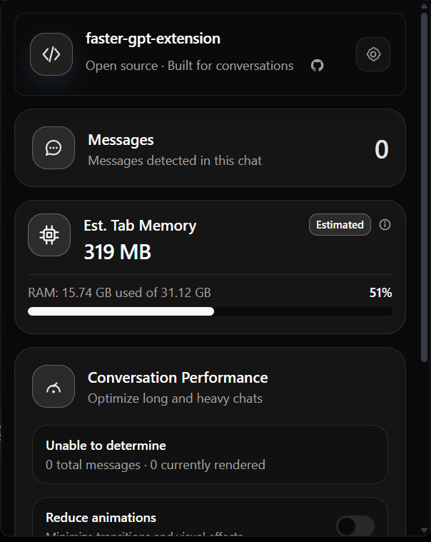
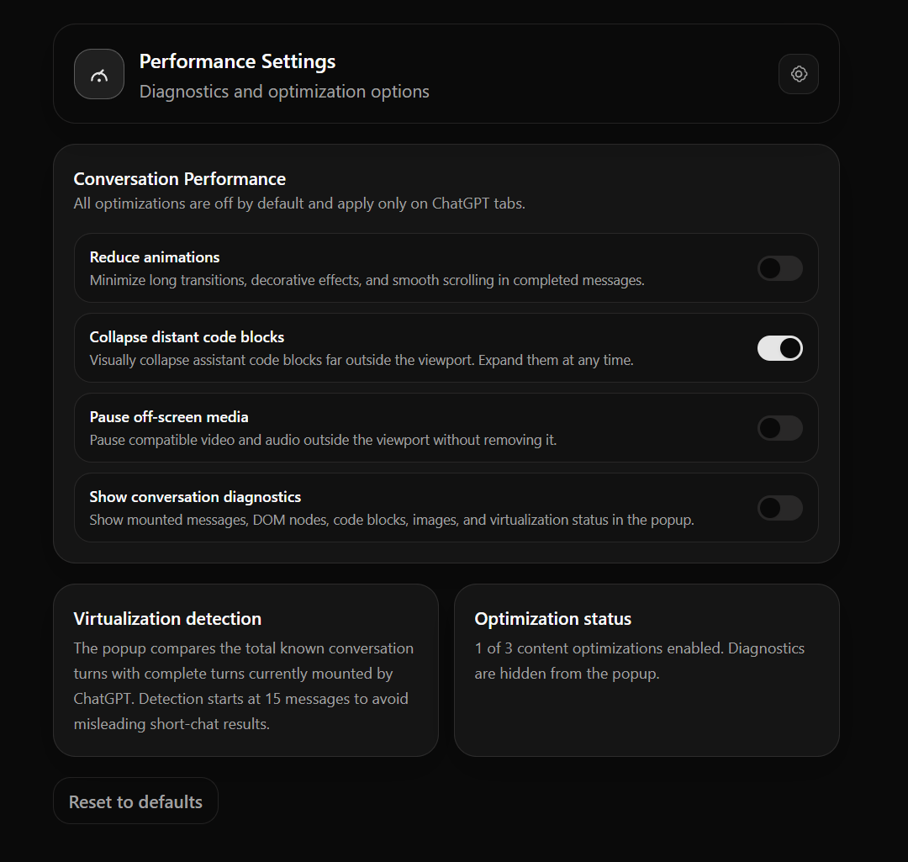

# ⚡ FasterGPT Extension

[](LICENSE)
[](https://www.typescriptlang.org/)

> **See the landing:** [https://faster-gpt-extension.andrew-lenz.com](https://faster-gpt-extension.andrew-lenz.com)

An open-source browser extension that provides conversation performance metrics, virtualization awareness, and
content optimizations for ChatGPT — built for Vivaldi.

<div align="center">
  
</div>

## 🧠 What it does

ChatGPT already uses native message virtualization for long conversations. Instead of replacing it, this extension:

- **📊 Counts messages** — detects total conversation turns and currently mounted messages using ChatGPT's DOM structure.
- **👁️ Detects virtualization** — compares total messages against mounted messages, starting at 15 to avoid false positives.
- **💾 Monitors tab memory** — estimates page memory from JS heap, DOM, HTML, images, and resources.
- **⚙️ Content optimizations** — optional, opt-in: reduce animations, collapse distant code blocks, pause off-screen media.

<div align="center">
  
</div>

## 🎯 Features

### Popup card

- Total messages count and currently rendered count.
- Virtualization status (`detected`, `not-detected`, `unknown`).
- Estimated tab memory with five-component breakdown.
- System memory usage gauge.
- Conversation performance controls.
- Four themes: Dark, Atom, Sky, Ocean.

### Content optimizations (opt-in)

- **🎬 Reduce animations** — disables transitions and animations on completed messages without affecting streaming.
- **📝 Collapse distant code** — collapses assistant code blocks 800px+ outside the viewport; restores on scroll, click, or disable.
- **🔇 Pause off-screen media** — pauses video/audio far from the viewport without removing it.

All content changes are non-destructive: code stays in the DOM, search works, native streaming is never touched.

### Settings

- Persisted in extension local storage.
- Survive popup closes, page reloads, and browser restarts.
- Cross-page sync: popup and options page update each other in real time.

## 🏗️ Architecture

```
apps/extension/
  modules/
    conversation-performance/   📊 Metrics, virtualization, optimizations
    current-page/               🔍 Message count, memory diagnostics
    theme/                      🎨 Dark / Atom / Sky / Ocean
    header/                     🔝 Extension header with theme picker
    footer/                     📎 Credits and GitHub link
    extension/                  🧩 Popup shell composition
  entrypoints/
    popup/                      🔲 Extension toolbar popup
    options/                    ⚙️ Performance settings page
    content.ts                  📜 ChatGPT content script
    background.ts               💾 Storage persistence worker
```

## 🚀 Development

```bash
cd apps/extension

# Compile TypeScript
npm run compile

# Build the extension
npm run build

# Start Vivaldi with hot reload
npm run dev
```

Built with [WXT](https://wxt.dev), [React](https://react.dev), and [Zustand](https://zustand.docs.pmnd.rs).

## 🤖 AI tools

- [ChatGPT](https://chatgpt.com) — architecture planning, styling, code reviews.
- [OpenCode](https://github.com/anomalyco/opencode) — code generation with GPT and DeepSeek models.

## 📄 License

MIT — open-source and free to modify and redistribute.
